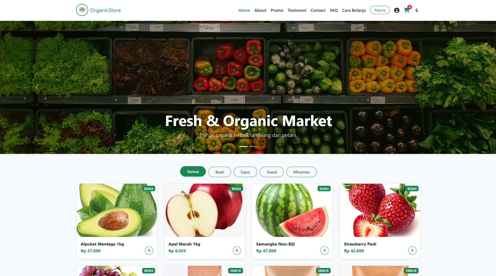
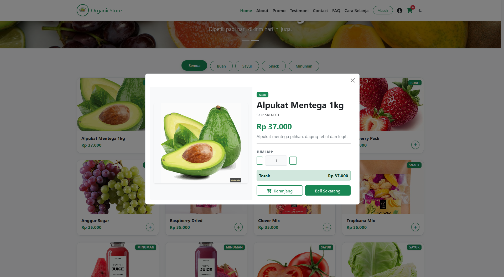
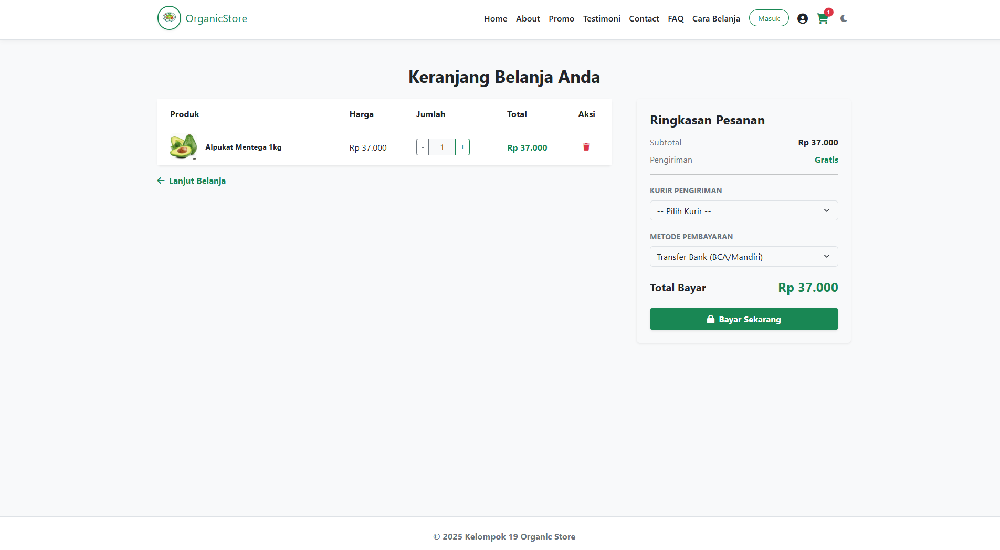
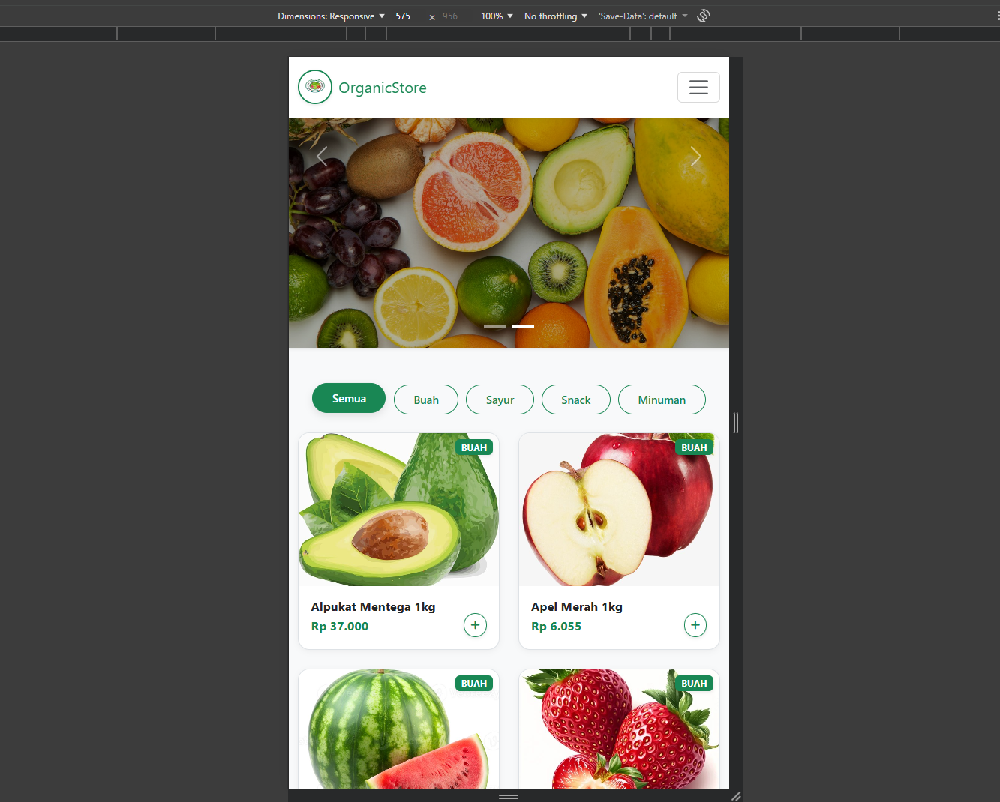

# 🥗 Organic Store - Kelompok 19

**Organic Store** adalah platform e-commerce berbasis web yang menyediakan berbagai produk organik segar seperti buah, sayur, makanan ringan, dan minuman sehat. Proyek ini dibuat sebagai tugas akhir (UAS) mata kuliah **Pemrograman Web**.

Website ini dirancang dengan tampilan modern, **Responsive**, **Interaktif**, dan dilengkapi fitur **Dark Mode**.

---

## 👥 Anggota Kelompok

| Nama | NIM |
|------|-----|
| ZULFAHAN UMILLAH | 0110125127 |
| RIFALDI HIDAYAT | 0110125090 |
| MAULAD ARDAFFA P | 0110125147 |
| NAZKA KHAULAH S | 0110125100 |
| MUHAMMAD HILMI | 0110125033 |

---
## 📖 Deskripsi Website
**Organic Store** adalah website e-commerce yang menyediakan berbagai produk organik segar, termasuk buah-buahan, sayuran, makanan ringan, dan minuman sehat. Website ini dirancang untuk memberikan pengalaman berbelanja yang mudah dan menyenangkan bagi pengguna yang peduli dengan gaya hidup sehat. Dengan tampilan yang modern dan responsif, Organic Store memastikan kenyamanan pengguna baik saat diakses melalui desktop maupun perangkat mobile.
Website ini menampilkan katalog produk yang lengkap dengan informasi detail, sistem keranjang belanja yang interaktif, serta fitur Dark Mode untuk kenyamanan mata pengguna. Organic Store bertujuan untuk memudahkan konsumen dalam mendapatkan produk organik berkualitas tinggi secara online.

## ✨ Fitur Utama

### 🛒 Sistem Belanja (Shopping Cart)
- **Real-time Cart:** Menambah produk ke keranjang tanpa reload halaman.
- **Persistent Storage:** Data keranjang tersimpan otomatis di browser (LocalStorage), sehingga tidak hilang saat di-refresh.
- **Kalkulasi Otomatis:** Menghitung subtotal dan total harga secara otomatis.

### 🎨 Tampilan & UX
- **Dark Mode / Light Mode:** Pengguna bisa mengganti tema sesuai kenyamanan mata.
- **Responsive Design:** Tampilan rapi di Desktop, Tablet, dan Mobile.
- **Interaktif:** Efek hover pada kartu produk dan animasi halus saat halaman dimuat.

### 📱 Manajemen Produk
- **Katalog Lengkap:** Menampilkan produk Buah, Sayur, Snack, dan Minuman.
- **Filter Kategori:** Memudahkan pencarian produk berdasarkan jenisnya.
- **Modal Detail:** Klik produk untuk melihat detail lengkap (Gambar, Deskripsi, Harga) dalam pop-up.

### 🔐 Fitur Pengguna
- **Simulasi Login & Register:** Halaman masuk dan daftar yang terintegrasi.
- **Halaman Profil:** Menampilkan data diri pengguna dan riwayat pesanan (dummy).
- **Form Checkout:** Simulasi pengiriman dengan pilihan kurir dan metode pembayaran.

---

## 🛠️ Teknologi yang Digunakan

Proyek ini dibangun menggunakan teknologi web standar:

* **HTML5** - Struktur dasar halaman web.
* **CSS3** - Styling kustom dan variabel CSS untuk tema warna.
* **Bootstrap 5.3** - Framework CSS untuk layout grid, navbar, modal, dan komponen responsif.
* **JavaScript (Vanilla ES6)** - Logika pemrograman untuk keranjang belanja, filter produk, dan manipulasi DOM.
* **Font Awesome 6** - Ikon antarmuka (User, Cart, Moon/Sun).

---

### 📸 Screenshot Tampilan

---

## 📸 Galeri Tampilan

Berikut adalah cuplikan tampilan dari website Organic Store:

### 🏠 Tampilan Utama (Home)
Menampilkan banner slider, navigasi lengkap, dan fitur pencarian kategori.

## tampilan dark mode

### 🥬 Katalog Produk
Daftar produk dengan harga, kategori, dan tombol "Tambah ke Keranjang" yang interaktif.

### 🛒 Keranjang Belanja
Fitur keranjang yang dapat menghitung total harga secara otomatis.

### 📱 Tampilan Responsif (Mobile)
Website tetap rapi dan mudah digunakan saat dibuka melalui handphone.
